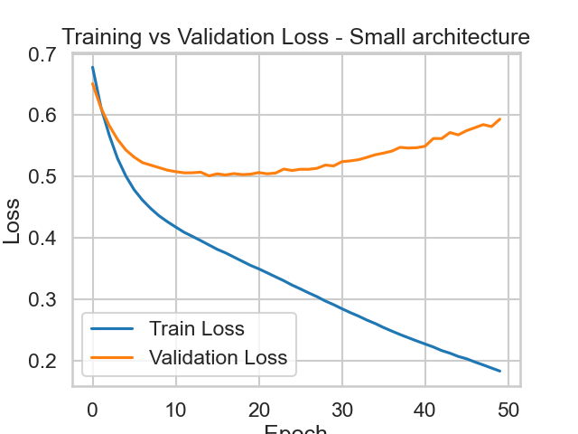
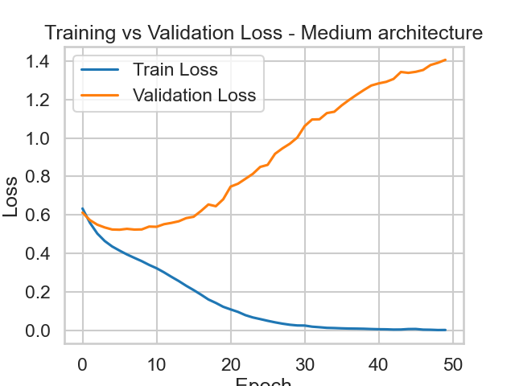
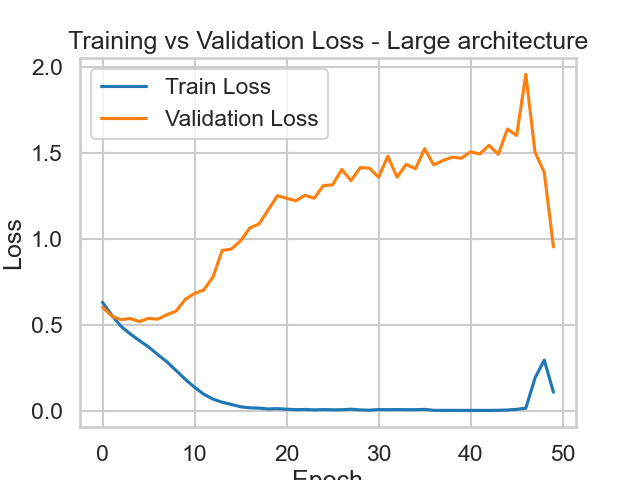
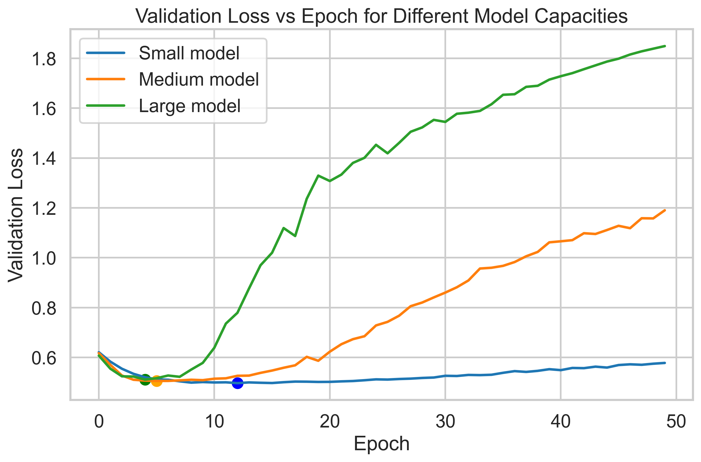

# Credit Risk Prediction using Artificial Neural Networks
=========================================================

### A Study of Model Capacity, Overfitting, and Generalization on Tabular Financial Data

Overview
--------

Financial institutions need to estimate whether a borrower is likely to default on a loan.\
This project explores how **Artificial Neural Networks behave when modeling tabular financial data**, specifically focusing on how **model capacity affects overfitting and generalization**.

Instead of training a single model, I trained **multiple neural network architectures with different capacities** and analyzed their training dynamics.

The goal of this experiment is to understand:

-   How neural network **capacity influences memorization**

-   When **overfitting begins during training**

-   Which architectures generalize best on **small tabular datasets**

* * * * *

Problem Setup
=============

Input: financial attributes of a loan applicant\
Output: probability of loan default

This is a **binary classification problem**:

0 → Safe borrower\
1 → Risky borrower

The model learns:

P(default | financial features)

* * * * *

Dataset
=======

Dataset used: **German Credit Dataset**

Key characteristics:

-   ~1000 total samples

-   ~20 original features (expanded after one-hot encoding)

-   Train/test split: **80 / 20**

After preprocessing:

Training samples ≈ 800\
Test samples ≈ 200\
Feature dimension ≈ 60

* * * * *

Training Pipeline
=================

The following preprocessing steps were applied before training:

1.  One-hot encoding of categorical variables

2.  Train/test split

3.  Feature standardization

4.  Conversion to PyTorch tensors

5.  Mini-batch training using DataLoader

Training configuration:

Loss function  : BCEWithLogitsLoss\
Optimizer      : Adam\
Batch size     : 32\
Epochs         : 50

Evaluation metrics:

Accuracy\
Precision\
Recall\
F1 Score

* * * * *

Neural Network Architectures
============================

Three architectures were trained to study the effect of model capacity.

### Small Network

60 → 32 → 1\
≈ 1920 parameters

### Medium Network

60 → 64 → 32 → 1\
≈ 6000 parameters

### Large Network

60 → 128 → 64 → 32 → 1\
≈ 18000 parameters

A fourth experiment was added to test **regularization**:

### Medium + Dropout

60 → 64 → 32 → 1\
Dropout = 0.3

* * * * *

Training Dynamics
=================

Training and validation loss curves were recorded for each architecture.

Key observation:

Training loss consistently decreases\
Validation loss eventually increases

This indicates **overfitting**, where the network begins memorizing training samples instead of learning general patterns.

* * * * *

# Training Curves

### Small Architecture

### Medium Architecture

### Large Architecture

# Model Capacity vs Overfitting

The figure below compares validation loss across different model capacities.

The large model begins overfitting earliest (~epoch 6), while the smaller model maintains stable validation performance for longer. This illustrates how increasing model capacity accelerates memorization when training on small tabular datasets.

Results
=======

| Model | Architecture | Best Epoch | Accuracy | Precision | Recall | F1 |
| --- | --- | --- | --- | --- | --- | --- |
| Small | [32] | 13 | 0.80 | 0.661 | 0.661 | 0.661 |
| Medium | [64,32] | 9 | 0.77 | 0.603 | 0.644 | 0.623 |
| Large | [128,64,32] | 6 | 0.775 | 0.616 | 0.627 | 0.622 |
| Medium + Dropout | [64,32] | 12 | 0.785 | 0.633 | 0.644 | 0.639 |

* * * * *

Experimental Insights
=====================

### 1\. Model capacity strongly affects overfitting

Small model  → slower overfitting\
Medium model → balanced performance\
Large model  → fastest memorization

Larger networks have significantly more parameters, which increases their ability to **fit complex functions**.\
However, on small datasets this often leads to **memorization rather than generalization**.

* * * * *

### 2\. Larger models achieve lower training loss but worse generalization

The large network quickly drives training loss close to zero.\
However, its validation loss begins increasing after **~6 epochs**, indicating that it has started memorizing the training set.

* * * * *

### 3\. Moderate capacity networks generalize best

The medium-sized network achieves the most balanced performance between:

model capacity\
training stability\
generalization

* * * * *

### 4\. Dropout delays overfitting

Adding dropout to the medium architecture slightly improves generalization by reducing reliance on individual neurons.

This acts as a **regularization mechanism**, encouraging the network to learn more robust feature representations.

* * * * *

Key Takeaway
============

Increasing neural network capacity leads to faster memorization of the training data.

While larger models achieve lower training loss, their validation performance deteriorates earlier due to overfitting.

On small tabular datasets, **moderate-capacity networks combined with regularization techniques often provide the best balance between learning power and generalization.**

* * * * *
